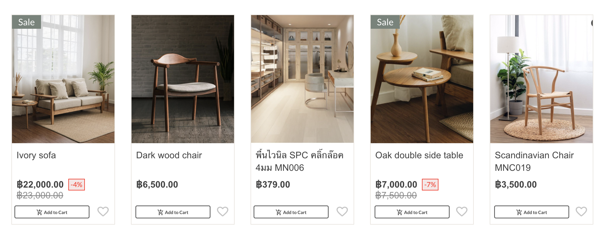

# My Magento StoreFront

As a store owner I would like to have ecommerce website where I can show all my available products and product detail online

in this proeject we built it on top of Magento-Venia ui so we would like to change design with our own using some UI framwork like MUI or any preference

 

## Instruction

-   Checkout main branch
-   run yarn install
-   run yarn watch

 

## Assignment

-   Apply any UI framwork (mui, ant, tailwind or any you prefer) to make sure our website look better
     
    for example design
    
-   Add new route to create new promotions page showing
    some promotions under that page
    
-   Customize breadcrumb to have following design
    

 

Documentation for Magento PWA Studio packages is located at [https://pwastudio.io](https://pwastudio.io).
